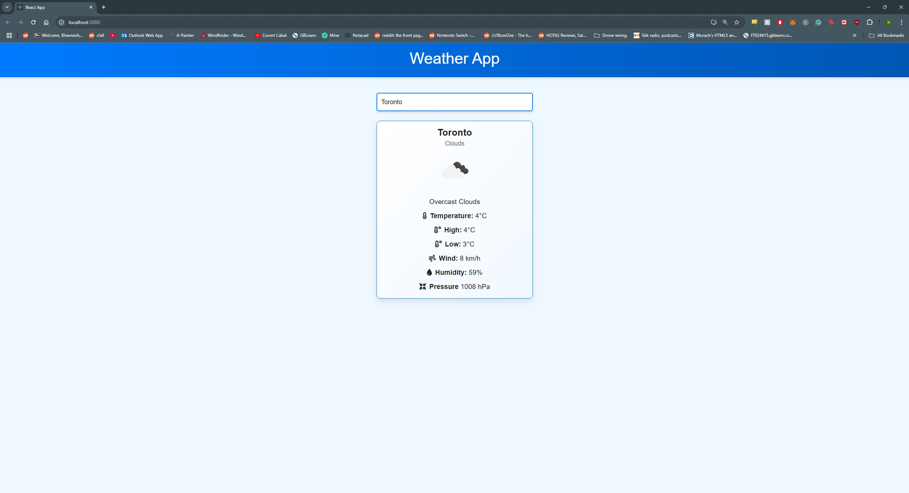
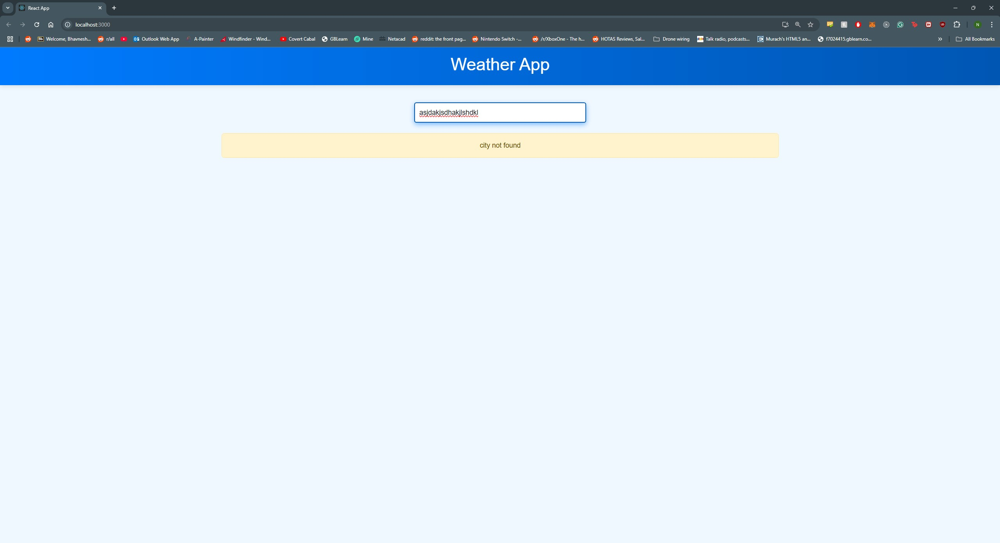
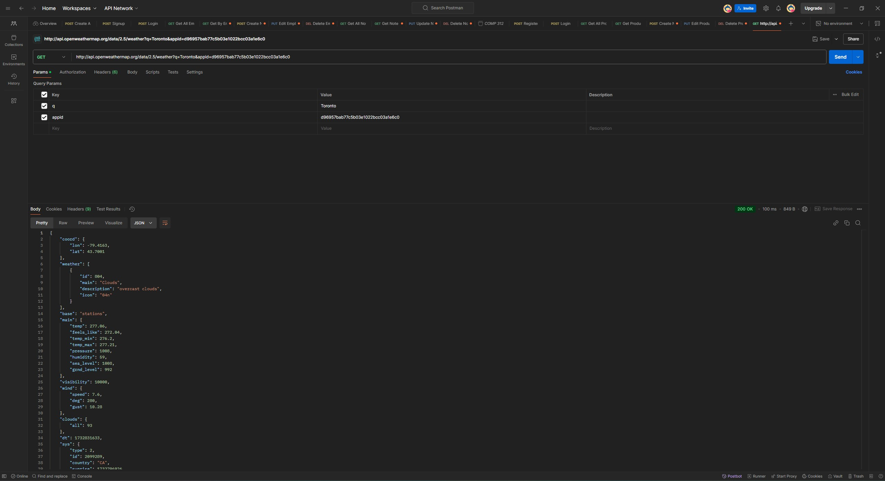

# Weather App - ReactJS

## Description
A simple weather app built with ReactJS that allows users to search for current weather conditions by city. The app displays key details such as temperature, wind speed, humidity, and pressure.

## Features
- Search for weather by city name.
- Displays weather conditions with icons, temperature, and additional details.
- Responsive UI using Bootstrap.

## API Used
- [OpenWeatherMap API](https://openweathermap.org/)

## Setup Instructions
1. Clone the repository: `git clone git@github.com:nashman100/101024415_comp3123_labtest2.git`
2. Install dependencies: `npm install`
3. Add your API key to a `.env` file:
   ```
   REACT_APP_WEATHER_API_KEY=<Your API Key>
   ```
4. Start the app: `npm start`

## Screenshots

Page loads with Toronto set as the default location

Page dynamically changes once a new city is entered into the input bar

Page returns city not found if an invalid city name is entered

Postman Screenshot
## Author
- Nash Gill
- Student ID: 101024415