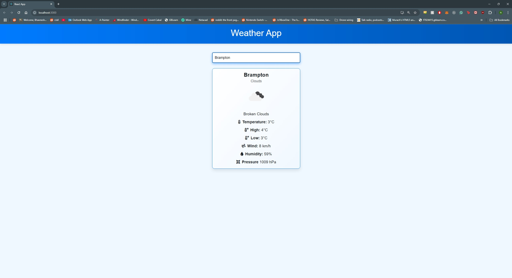

# Weather App - ReactJS

## Description
A simple weather app built with ReactJS that allows users to search for current weather conditions by city. The app displays key details such as temperature, wind speed, humidity, and pressure.

## Features
- Search for weather by city name.
- Displays:
  - Current temperature.
  - High and low temperatures.
  - Wind speed.
  - Humidity and pressure.
- Includes weather condition icons from OpenWeatherMap.
- Error handling for invalid city names.
- Responsive UI built using Bootstrap.
- Default city (Toronto) loads on page start.

## API Used
- [OpenWeatherMap API](https://openweathermap.org/)

## Setup Instructions
1. Clone the repository: `git clone git@github.com:nashman100/101024415_comp3123_labtest2.git`
2. Install dependencies: `npm install`
3. Add your API key to a `.env` file in the root of your project: Replace `your_api_key_here` with your actual API key from OpenWeatherMap.
4. Start the app: `npm start`

## Screenshots

### Default Page

Page loads with Toronto set as the default location.

### Changed City Page

Page dynamically changes once a new city is entered into the input bar.

### City Not Found

Page returns "city not found" if an invalid city name is entered.

### Postman Screenshot

This screenshot demonstrates the API call and response format in Postman, showcasing how the app interacts with the OpenWeatherMap API.

## Technologies Used
- ReactJS: For building the user interface.
- Axios: For making API calls.
- Bootstrap: For responsive styling.
- OpenWeatherMap API: For fetching real-time weather data.
- Postman: For testing API endpoints.

## Author
- Nash Gill
- Student ID: 101024415